<Update label="January 2026">

### 🤖 Model provider selection (Claude support)

Olly now supports **Claude** as an additional AI [model provider](https://docs.olly.new/content/olly-model-selection), alongside GPT.

You can choose the provider that best matches your preferred tone and reasoning style:

- **Claude**: Clear, structured responses with a strong analytical approach.
- **GPT**: Flexible reasoning with a familiar conversational style.

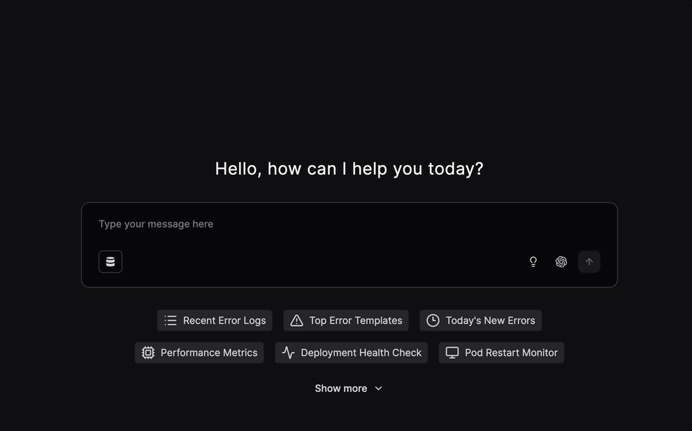

Your selected provider is used consistently throughout the conversation, giving you more control over how Olly thinks and responds.

### 💬 Olly ↔ Slack user alignment

Olly is now better aligned with [Slack](https://docs.olly.new/content/olly-slack-integration) users, making collaboration smoother and more predictable.

This improvement ensures:

- Slack messages are correctly associated with the matching Olly user.
- Permissions and usage are applied consistently across Slack and Olly.

The result is a more seamless experience when asking questions, investigating issues, or collaborating directly from Slack.

### 📊 Dynamic tables CSV export

Olly now supports [CSV export](https://docs.olly.new/content/olly-dynamic-tables-csv-export) for table artifacts, making it easy to download structured results for analysis, reporting, or sharing in external tools.

### 📱 Mobile support

Olly is now available on mobile, bringing the same investigation and troubleshooting capabilities to your phone.  
You can ask questions, review past conversations, and continue investigations on the go, making it easier to access insights whenever and wherever you need them.

</Update>

<Update label="December 2025">

### 🎉 Olly is now generally available (GA)

Olly is production-ready and can be used in day-to-day observability workflows. It is available for all eligible users, with a stable feature set, improved reliability, and ongoing support.

### 🔗 Data sources

[Data sources](https://docs.olly.new/content/olly-data-sources-intro) let you connect Olly to Coralogix data by defining the team, auth method (API key or OAuth), and who can use it.

Why this matters:

- Better, scoped answers: Olly queries only the data you approve
- Control you can scale: Manage access cleanly across teams and environments

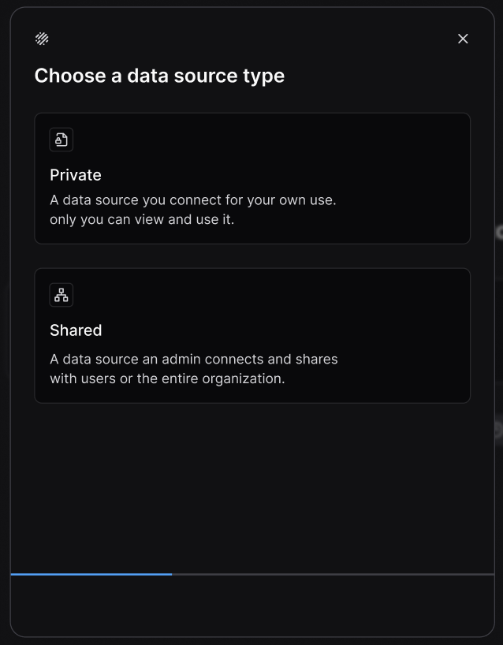

### 🔐 Sign in with Coralogix

You can now sign in to Olly using your [Coralogix](https://docs.olly.new/content/olly-orgs-and-regions#continue-with-coralogix) account, with permissions and access fully aligned to Coralogix.

This secure, one-click sign-in:

- Automatically connects Olly to the Coralogix teams and data sources you already have permission to access
- Enforces the same user roles and access controls defined in Coralogix
- Removes the need to manage separate credentials or API keys

The result is a faster, safer setup—making it easy to connect Olly to your data while staying fully aligned with existing security and permission models.

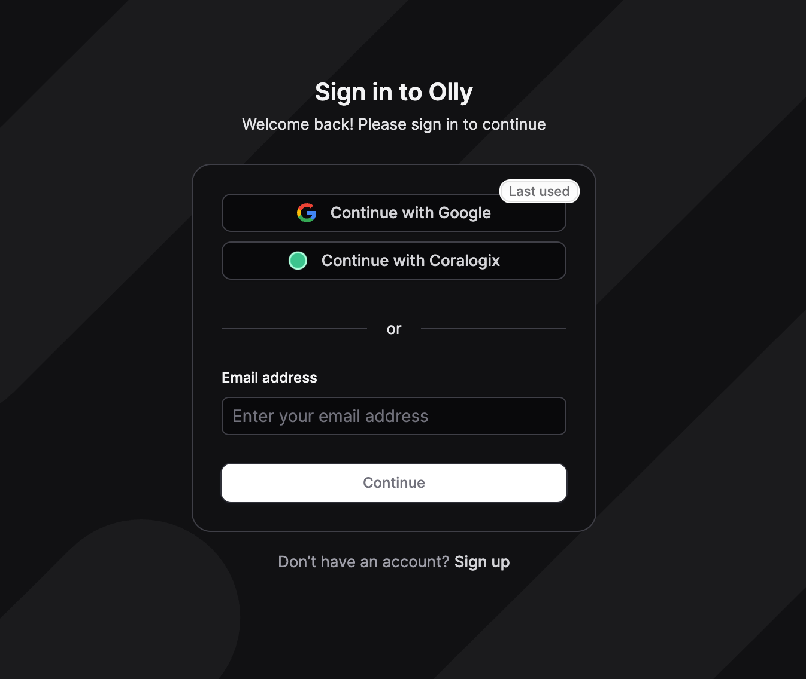

### ⌘ Enhanced search functionality

The search experience just got more powerful.

Previously, search results were limited to conversation titles. Now, Ctrl+K (Windows) or Command+K (macOS) searches across the full content of past conversations, including:

- Questions you asked Olly
- Answers and explanations provided by Olly

This makes it much easier to rediscover previous investigations, insights, or troubleshooting steps—without needing to remember exact conversation titles.

</Update>

<Update label="November 2025">

### ⚙️ User rules

Personalize how Olly works for you with custom [user rules](https://olly.mintlify.app/content/olly-user-rules).

Add preferences or context – like response style, key workflows, or data patterns – so Olly can better understand your environment and deliver more accurate insights.

### 🗣️ Feedback for Olly

You can now share direct feedback on Olly’s responses to help improve accuracy and experience. Mark any answer as helpful or unhelpful, choose what went wrong, and optionally add a short comment for more context.

Your feedback helps us fine-tune Olly’s reasoning and response quality over time!

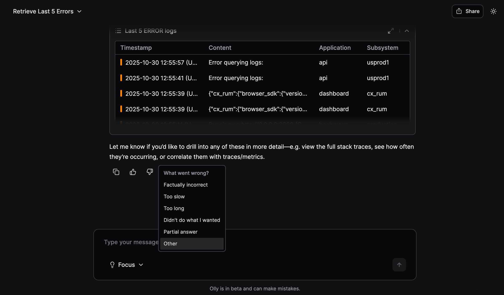

### 📊 Ask Olly about your dashboards

You can now **give Olly any Coralogix dashboard link** and get instant insights.

Share any dashboard URL to get summaries of anomalies, spot unusual spikes or drops, or ask about root causes – like which service contributed to a latency event – all without digging through panels.

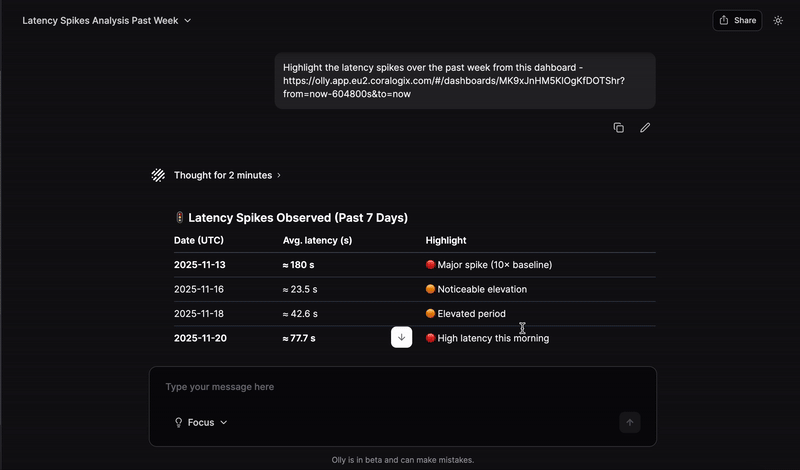

</Update>

<Update label="October 2025">

### 💬 Slack integration

Olly is now available directly in [Slack](https://olly.mintlify.app/content/olly-slack-integration), bringing intelligent insights and context into your team’s daily workflows. Mention your region-specific handle (e.g., @Olly-EU2) in channels or DMs to get threaded answers and linked artifacts without leaving Slack.

This integration helps teams collaborate seamlessly, and act on insights faster.

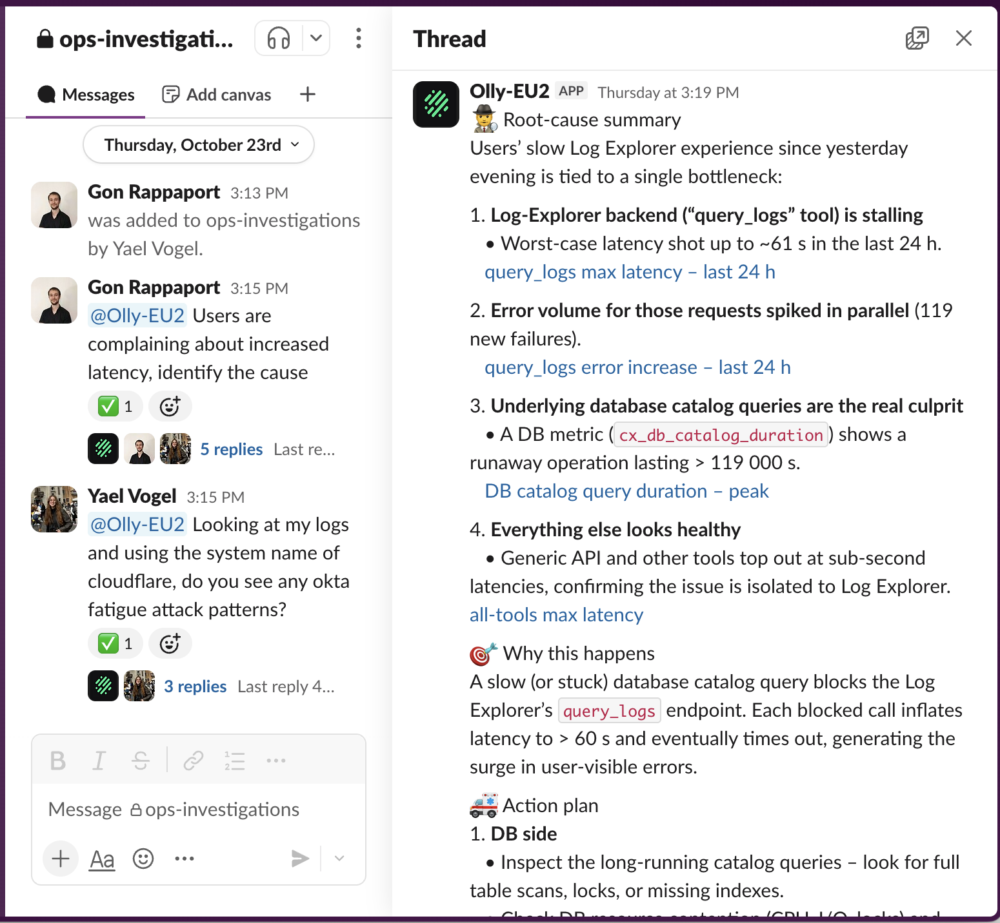

### ✨ Fast mode

Olly now supports [two powerful modes](https://olly.mintlify.app/content/olly-fast-focus-modes) to match your workflow. **Fast Mode** delivers responses at lightning speed, helping you get quick answers and act instantly when time matters most. For deeper analysis and richer context, switch to **Focus Mode**, which provides detailed, in-depth insights.

Effortlessly toggle between modes to balance speed and depth – get exactly what you need, when you need it.

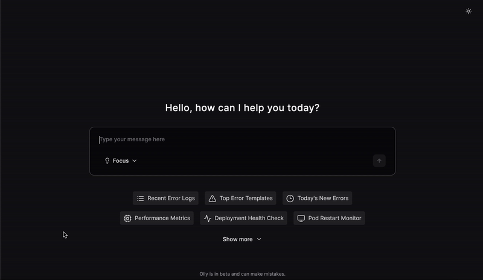

### 🔗 Chat sharing

Share Olly sessions and insights with your team using shareable links – making collaboration fast and effortless.

- You can toggle sharing on or off at any time.
- Shared chats are view-only for others.

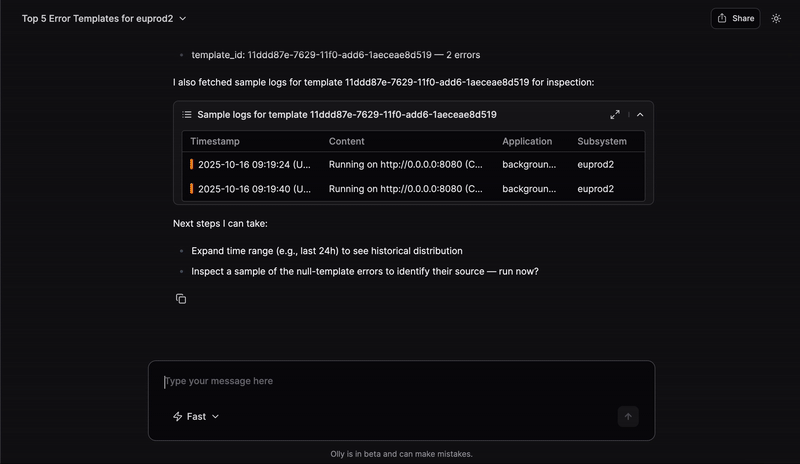

### 🧩 Artifact previews

You can now see artifact previews directly in Olly’s responses – including logs, traces, metrics, alerts and charts.

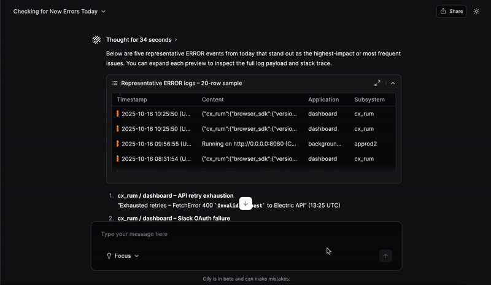

### 🗑️ Chat deletion

You can now easily delete chat titles using the new chat deletion feature.

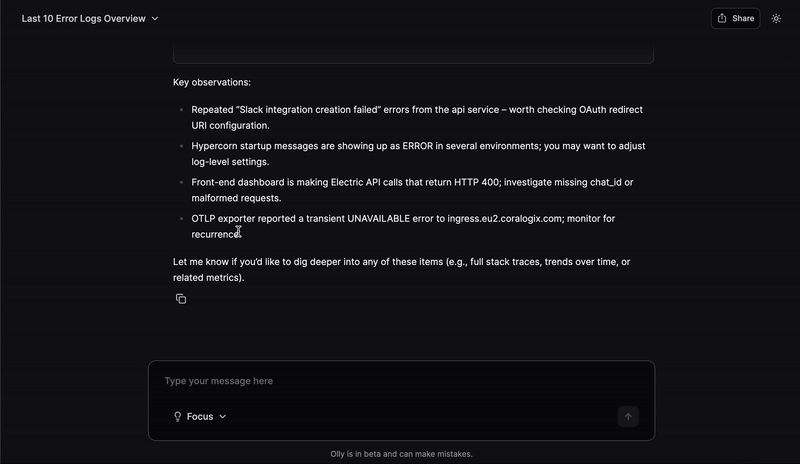

### ✏️ Message editing

Easily edit your prompts and get an updated response – no need to start a new chat.

### ⚡ Access to alerts

Olly now has access to your Coralogix alerts and incidents, in addition to logs, metrics, and traces. Ask natural questions to get linked answers with context and suggested next steps.

**Try asking:**

- What's my most recent alert?
- What is the root cause of this alert?
- Why was an alert triggered at 00:05 on Sunday?
- I see this error. What alert would you suggest I set up to monitor this?
- Give me a list of all of the alerts I have set up for this environment.

### 📋 Prompt templates

Get started faster with ready-made prompt templates. Select a template, and Olly will fill in a suggested prompt you can modify and run. Templates cover common onboarding and troubleshooting flows, helping you move from question to insight more quickly.

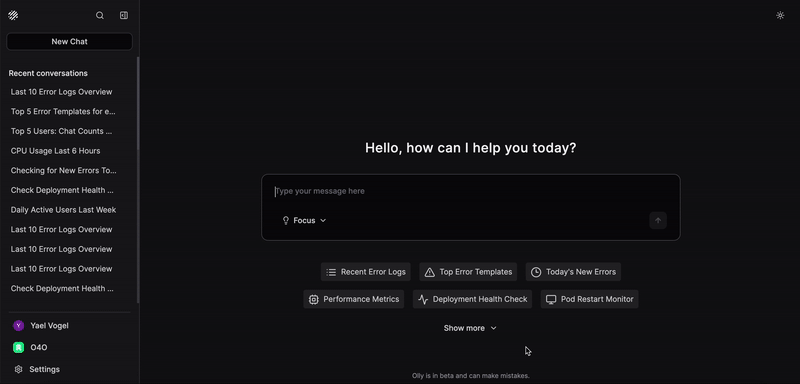

### 🔍 Search functionality

Find past work faster with chat search. Use the search box or press **Ctrl+K** (Windows) or **Command+K** (macOS) to search your chat titles and content.

</Update>