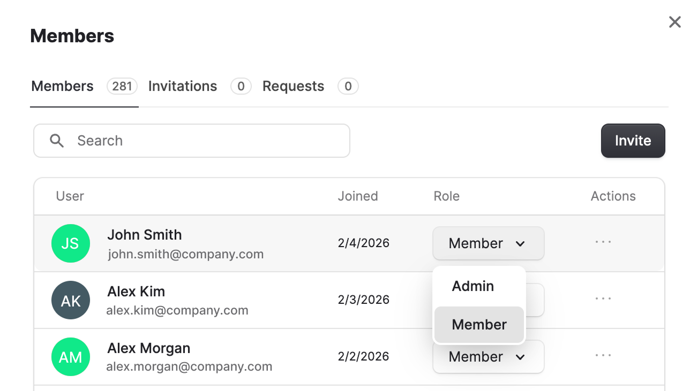

Find answers to the most frequently asked questions about users management and billing.

<Accordion title="How can I make sure all Coralogix users can access their organization in Olly?">
    There are two ways to access Olly:

    1. **Auto-invite by domain** (recommended): If the organization has auto-invite by domain enabled, any user with an email from the approved domain can automatically join the organization. If a domain is missing, an admin can add it in the organization settings or request it via the `cxai-interface`.
    
    2. **Manual invitation**: If auto-invite by domain is not used, an organization admin can manually invite users to Olly.
</Accordion>

<Accordion title="How do I define which users can access Olly?">
    Olly organization admins can invite users to their org. They can also assign seats to specific users based on purchased and available licenses.
</Accordion>

<Accordion title="Can I monitor Olly token usage?">
    Yes. Admins can monitor token usage at the organization level.
        - Go to **Settings → Usage Management**.
        - View token consumption across users and seat types.
        - Usage is tracked per seat and resets monthly.
</Accordion>

<Accordion title="How can I invite users to Olly?">
    Olly organization admins can invite users by navigating to their user profile in the sidebar, selecting the organization name, then **Members → Invite**.
    
</Accordion>

<Accordion title="How does the seat model work?">
    Olly has three plans: **Free**, **Basic**, and **Pro**. The main difference between these plans is the token limit.

    - Users are assigned to seats.
    - A user can be upgraded at any time, as long as a seat is available in the higher tier.
    - A user can be downgraded anytime unless they already exceeded the token limit of the lower tier.
    - If they exceeded it, the downgrade can only take effect at the end of the month.
</Accordion>

<Accordion title="Do users get a free trial?">
    Yes. Every Coralogix user automatically receives a Free Plan seat, allowing them to use Olly immediately until they reach their free-tier token limit.
</Accordion>

<Accordion title="Does Olly support pay-as-you-go?">
    Currently - no. Users must pay via contract for now.
</Accordion>