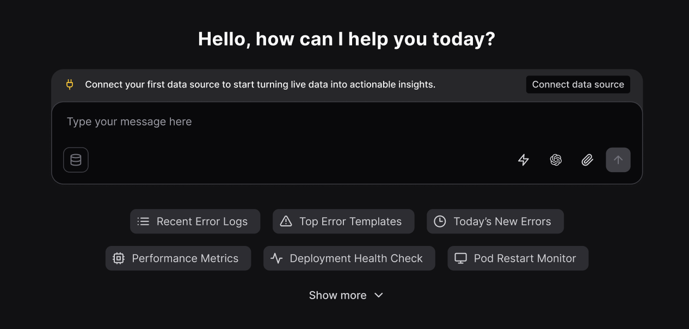

Olly connects directly to your Coralogix data so it can answer questions about your systems.

Data sources define which Coralogix teams and environments Olly is allowed to use.

To learn more about data sources, visit [data sources introduction](https://olly.mintlify.app/content/olly-data-sources-intro).

## Creating a private data source

1. Go to **Settings → Data sources**.
2. Select **Add data source → Coralogix**.
3. Choose **Private**.
4. Choose how Olly should connect to Coralogix:
    - If you signed in with Coralogix:
        - Select a team from the list of teams in your region, or
        - Switch to manual mode and paste a read-only API key.
    - If you signed in with Gmail:
        - Paste a read-only API key for the team you want to query. For private data sources, you should use a personal API key.
5. Give the data source a name (for example, `My Prod`, `Staging`) and select **Connect**.

## Creating a shared data source (admins)

1. Go to **Settings → Data sources**.
2. Select **Add data source → Coralogix**.
3. Choose **Shared**.
4. Paste a team-level API key for the team you want to connect. 
5. Set sharing:
    - Everyone in the organization, or
    - Specific users (you can update this later)
    - Optionally mark the data source as available for Slack.
6. Name the data source (for example, `Production`, `EU Prod`, `Shared Sandbox`) and select **Connect**.

<Note>If you don’t have a data source yet, Olly may guide you with a one-time animation, a persistent banner above the chat, a tooltip from the data source icon, or a connect modal after sending a message — all leading to the same setup flow. </Note>

## Selecting data sources when you chat

When you ask Olly a question, you can control which data it uses.

In the chat UI, use the data source selector inside the message box. Olly can use one Coralogix data source at a time for each query.

What gets selected by default:

- **If you connected one data source (shared or private)**: That data source is selected automatically in the chat without the blue dot indicator.

- **If you connected multiple data sources**: Olly automatically selects the first data source you marked as the default/primary one.
A blue dot indicator appears to highlight that a selection was made — you can change it anytime from the data source selector in the message box.

    

First time you enter an organization:

- **If the organization has at least one data source shared with you**: Olly selects the first data source in the list and shows the blue dot indicator (same behavior as when multiple data sources exist and one is auto-selected).

- **If the organization has exactly one shared data source**: Olly selects it automatically and does not show the indicator.

Olly validates that:

- The region of the Coralogix team matches the region of your Olly organization.
- The API key is valid.
- The required permissions are present (see below).

If anything is missing or mismatched, including the region, you will see an error.

## Next steps

Once you connect a data source, Olly starts building the knowledge base. You can immediately begin asking questions in the chat, switch between available data sources from the message box, or add additional private or shared sources as needed.
For more information, visit our [FAQs page](https://docs.olly.new/content/olly-data-sources-faqs).

## Coralogix permissions requirements

The following permissions should be attached individually or as presets to your API key, to access all relevant data in your Olly queries.

To add or modify permissions for a user role, refer to our [Role-Based Permissions](https://coralogix.com/docs/user-guides/account-management/user-management/create-roles-and-permissions/) tutorial.

Your Coralogix [API key](https://coralogix.com/docs/user-guides/account-management/api-keys/api-keys/) should have the following configurations:

<Accordion title="APM">

    | Permission | Description |
    | --- | --- |
    | `serverless:Read` | View Serverless Monitoring data. |
    | `service-catalog:ReadDimensionsConfig` | Not listed in the permissions list. |
    | `service-catalog:ReadSLIConfig` | Not listed in the permissions list. |
    | `service-catalog:UpdateDimensionsConfig` | Manage Service Catalog dimensions. |
    | `service-catalog:UpdateSLIConfig` | Manage Service Catalog SLIs. |
    | `service-map:Read` | View Service Map. |
    | `service-catalog:Read` | View Service Catalog data. |
    | `service-catalog:ReadApdexConfig` | Not listed in the permissions list. |
    | `service-catalog:UpdateApdexConfig` | Manage the Apdex configuration. |
    | `service-catalog:Update` | Manage Service Catalog services. |
</Accordion>

<Accordion title="Dashboards">

| Permission | Description |
| --- | --- |
| `team-dashboards:Read` | View public Custom Dashboards. |
| `team-dashboards:Update` | Manage public Custom Dashboards. |
| `user-dashboards:Read` | View private Custom Dashboards. |
| `user-dashboards:Update` | Manage private Custom Dashboards. |
</Accordion>

<Accordion title="DataQuerying">

| Permission | Description |
| --- | --- |
| `legacy-archive-queries:Execute` | Query data from the S3 archive. |
| `logs.data-api#high:ReadData` | Query frequent-search logs. |
| `logs.data-api#low:ReadData` | Query Monitoring and Compliance logs. |
| `metrics.data-api#high:ReadData` | Query metrics. |
| `metrics.data-api#low:ReadData` | Query metrics. |
| `spans.data-api#high:ReadData` | Query frequent-search spans. |
| `spans.data-api#low:ReadData` | Query Monitoring and Compliance spans. |
| `profiles.cpu-profiles:Read` | View CPU profiling data. |
</Accordion>

<Accordion title="Incidents">

| Permission | Description |
| --- | --- |
| `incidents:Acknowledge` | Acknowledge events in triggered alerts. |
| `incidents:Assign` | Assign an event in triggered alerts. |
| `incidents:Close` | Manually resolve events in triggered alerts. |
| `incidents:Read` | View events in triggered alerts. |
| `incidents:Snooze` | Snooze events in triggered alerts. |
</Accordion>

<Accordion title="SLO">

| Permission | Description |
| --- | --- |
| `slo-mgmt.alerts:ReadConfig` | View SLO-based Alert Settings. |
| `slo-mgmt.alerts:UpdateConfig` | Manage SLO-based Alert Settings. |
| `slo:ReadConfig` | View SLO Settings. |
| `slo:UpdateConfig` | Manage SLO Settings. |
</Accordion>