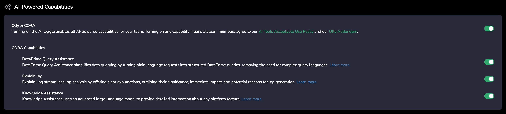

Find answers to the most frequently asked questions about data sources.

<Accordion title="How access control works on Olly? Is there special RBAC?">
    Olly does not introduce a separate RBAC model.
    Access in Olly is determined by the data source that is connected to it. When a data source is added (via API key or SSO), Olly operates according to the data scopes and permissions associated with that connection.
</Accordion>

<Accordion title="I just integrated Olly. How can I start asking it questions?">
    You must connect at least one data source for Olly to query. When a new Coralogix team is connected as a data source, Olly begins learning its data—this process can take up to 24 hours. Once complete, Olly’s accuracy improves dramatically.
</Accordion>

<Accordion title="Can I immediately start connecting data sources?">
    AI capabilities must be enabled in Coralogix by the admin. To allow data source connection, enable the **AI-Powered Capabilities** toggle in **Settings → Account Preferences**.
     
</Accordion>

<Accordion title="I just connected a data source. How can I start asking Olly questions?">
    Yes. However, once integrated, Olly starts learning your observability workspace. This process can take up to 24 hours. Once finished, Olly’s accuracy gets improved dramatically.
</Accordion>

<Accordion title="How can I identify which Coralogix team is connected to a data source in Olly?">
    If your organization has multiple Coralogix teams, identifying the correct one depends on how the data source was connected:

        - Connected using an access token (Sign in with **Coralogix → Coralogix tab**): Olly displays the exact Coralogix team name, making it easy to identify the corresponding account.
        - Connected **manually** using an API key: Olly currently does not display the Coralogix team name for API key–based connections. We’re aware this can be limiting and may improve this experience in a future update.
</Accordion>

<Accordion title="Can I target a specific team in the organization when running Olly queries?">
    At the moment, Olly runs queries based on the data sources and permissions available to the user, not by explicitly selecting a specific team within the organization.
</Accordion>