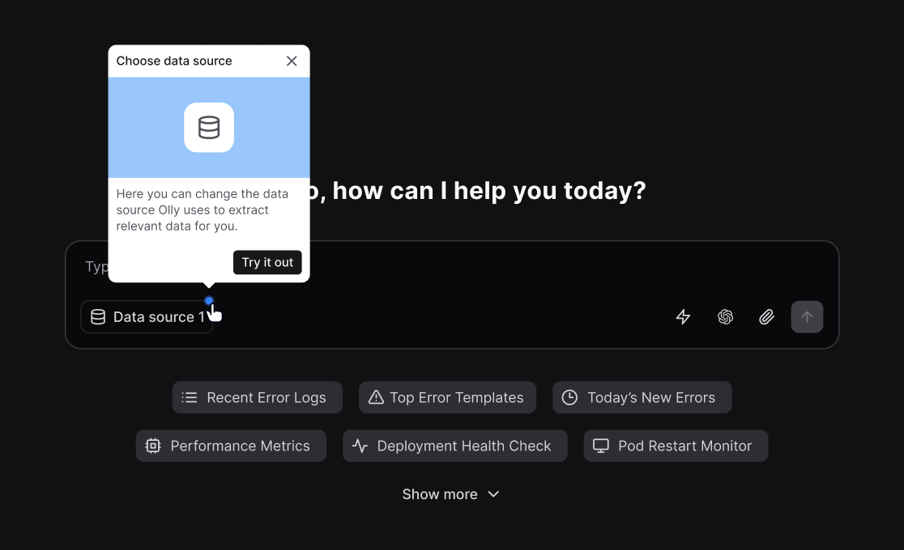

Data sources are how you tell Olly which data it is allowed to use.

## Access Olly

There are two sign-in methods for Olly: Coralogix sign-in and manual sign-in with Gmail.

### Coralogix sign-in

When you sign in with Coralogix, the region is determined by your Coralogix domain at the time of sign-in.

After you sign in:

1. You can create a data source:
    - A private data source may be created with a Coralogix access token or personal API key.
    - A shared data source may be created with a team API key.
2. You select one or more relevant Coralogix teams from that region.
3. You create either a private or a shared data source, depending on your Olly role and the sharing settings you choose.

### Manual sign-in (Gmail)

When you sign in manually:

1. You sign in to Olly with Gmail. Olly uses the default region that is configured for your Olly organization.
2. You can create private or shared data sources only by pasting an API key (personal or team, respectively).
3. The API key you use must belong to a Coralogix team in the same region as your Olly organization. If the regions do not match, data source creation fails.

For data source creation, this means:

- If you sign in with Gmail, you can create only manual data sources by pasting an API key.
- If you sign in with Coralogix, you can create data sources manually or by choosing a team from a list based on your Coralogix access token and region.

### Data sources

A data source tells Olly:

- Where to look (for example, which Coralogix team)
- How to authenticate (API key or OAuth)
- Who is allowed to use it

Today, the only data source type is Coralogix, which connects Olly to a single Coralogix team (the same team you use within the Coralogix UI).

Olly controls access to Coralogix data through data sources. Every question runs against one or more configured data sources that define which teams and telemetry Olly can query. 

## Types of data sources

Each data source can be private or shared.

<Columns cols={2}>
  <Card title="Private">
    - Visible and usable only by you (the creator).
    - Use your existing Coralogix permissions and policies.
    - Ideal if you want to ask Olly about your own Coralogix data without exposing it to others.
    - Can be created by any user, subject to the sign-in method and API keys they have.
  </Card>
  <Card title="Shared">
    - Created and managed by organization admins.
    - Mirror the permissions and policies associated with the Coralogix API key that the admin used when creating the data source.
    - Can be shared with:
        - Everyone in the organization, or
        - Specific users and/or specific integrations (for example, Slack).

    <Info>Because shared data sources mirror the creator’s Coralogix permissions, any data available to the creator becomes available to every user or integration that has access to that data source.</Info>
  </Card>
</Columns>

## Selecting data sources when you chat

When you ask Olly a question, you can control which data it uses.

In the chat UI, use the data source selector inside the message box. Olly can use one Coralogix data source at a time for each query.

What gets selected by default:

- **If you connected one data source (shared or private)**: That data source is selected automatically in the chat without the blue dot.

- **If you connected multiple data sources**: Olly automatically selects the first data source you marked as the default/primary one.
You’ll also see the blue dot animation and the guided panel prompting you to choose.

    

- **If you don’t explicitly choose a data source**: Olly uses your last selection.

First time you enter an organization:

- **If the organization has at least one data source shared with you**: Olly selects the first data source in the list and shows the blue dot indication (same behavior as when multiple data sources exist and one is auto-selected).

- **If the organization has exactly one shared data source**: Olly selects it automatically and does not show the blue dot.

Olly validates that:

- The region of the Coralogix team matches the region of your Olly organization.
- The API key is valid.
- The [required permissions](https://docs.olly.new/content/olly-cx-data-sources#coralogix-permissions-requirements) are present.

If anything is missing or mismatched, including the region, you will see an error.

## Editing or deleting a data source

From **Settings → Data sources**:

- Select a data source to:
    - Rename it.
    - Update sharing settings.
    - Re-authenticate (for example, rotate the API key).
- Admins can update or delete shared data sources.
- Users can manage their own private data sources.

Deleting a data source:

- Immediately removes it from the selector in chat and from integrations.
- Does not affect any underlying Coralogix configuration or data.

## Slack integration and data sources

Olly’s [Slack app](https://olly.mintlify.app/content/olly-slack-integration) lets your team ask questions directly from Slack.

Currently:

- Each Olly organization can connect a Slack workspace to one shared Coralogix data source.
- All queries from Slack use that data source.

To set up a Slack shared data source, visit the [Slack Integration](https://olly.mintlify.app/content/olly-slack-integration) page.