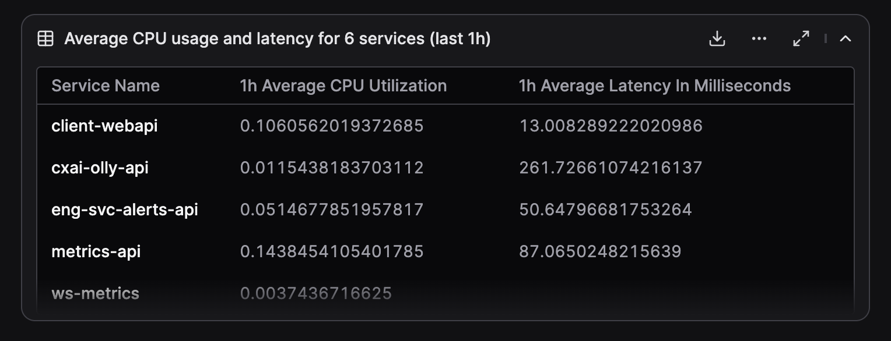

Dynamic tables let Olly return structured results as a table artifact. You can export tables to CSV to share results or continue analysis outside Olly.

 

## What data can be exported to CSV?

- The table CSV export can include data combined from multiple artifacts (logs, metrics, and spans).
- Each individual query result can also be exported as a CSV from the artifact drawer.

## What is a table artifact?

A table is rendered in the conversation:

- It appears inline in the chat as a preview.
- It can be expanded into a full table view.
- It can be exported as a CSV.

## How tables are generated

1. Ask a question that implies structured data (for example: *“Show the amount of errors and average CPU usage for every service”*).
2. Olly generates one or more queries based on the prompt.
3. Query results are combined and rendered as a table artifact.

Different columns may be backed by different queries or data types.

## Table interactions

The following actions are available:

**From the chat:**

- Expand the table for a full-screen view and extra functionality.
- Download CSV (also available when expanded).

**When expanded:**

- Sort columns in ascending or descending order.
- Clear sorting to return to the default order.
- Copy the table.