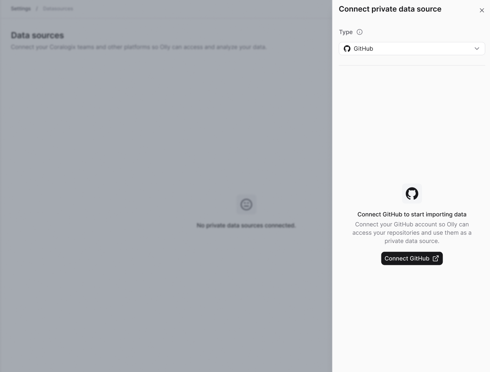
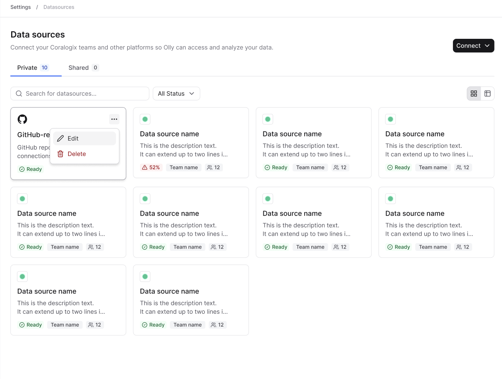
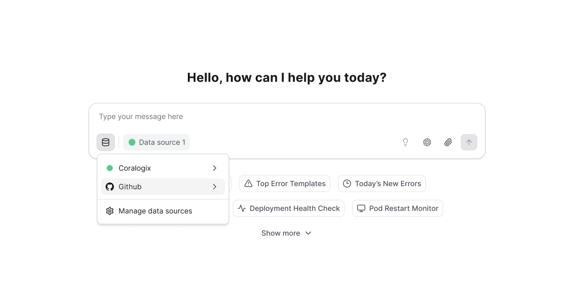

After the GitHub [integration](https://docs.olly.new/content/olly-github-integration) is enabled by an organization admin, individual users can connect their own GitHub repositories. This allows Olly to use code context from that repository when answering questions and running investigations.

<Note>GitHub data sources can only be created as **personal** data sources. Shared data sources are not supported for this integration.</Note>

## Connect GitHub as a data source

1. Go to **Data sources → Connect**.
2. Select **Personal data source**.
3. Set the type to **GitHub**.
4. Select **Connect GitHub**.
5. Complete the GitHub authentication flow.

Once connected, you can view, edit, or delete your GitHub data source from the **Data sources** menu.

<Note>If an admin disables or removes the GitHub integration, all GitHub data sources connected by users in the organization are immediately unavailable.</Note>

## Usage requirements

- GitHub data source is available only in [Focus](https://docs.olly.new/content/olly-fast-focus-modes) mode.
- Currently, Olly supports one GitHub data source per user, and one repository per data source (multi-repo support coming later).
- A specific repository must be selected to use code context. Queries cannot run without choosing a repository.

## Use GitHub data source in chat

When chatting with Olly in **Focus** mode, you can select the **GitHub data source**. Olly will automatically use code context when it’s relevant to your question or investigation.

### How it works

Once the integration is enabled and GitHub data source is connected, Olly can search and analyze your repository when code context is relevant, for example when:

- You ask about specific code behavior.
- Olly is conducting an investigation.
- Olly is performing root cause analysis.

Olly always works with the most up-to-date version of the repository and can analyze specific commits or points in time, making it easier to:

- Compare production vs. staging behavior.
- Identify regressions.
- Understand why an issue happens now but didn’t before.

### Insights & fixes

When code context is used, Olly can:

- Highlight exact file paths and line ranges.
- Explain why those lines matter.
- Suggest targeted fixes or code changes.