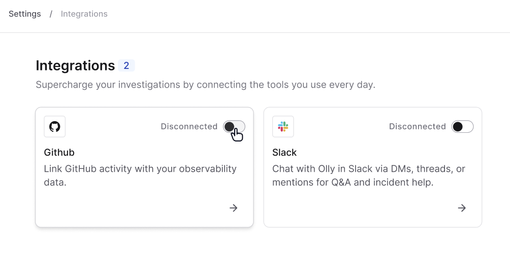

Integrate Olly with your GitHub repositories to understand code changes, investigate issues, and speed up delivery - from commit to production.

## Overview

The GitHub integration allows Olly to use code context when answering questions, running investigations, and performing root cause analysis. By connecting your repositories, Olly can link logs, errors, and alerts directly to the relevant code, highlighting the exact files and lines involved and guiding you toward the right fix.

## Why integrate GitHub?

Connecting GitHub helps Olly move investigations to source code:

- Reduce manual debugging by tracing errors and anomalies directly to code.
- Speed up investigations and RCA with file- and line-level context.
- Understand what changed and why an issue started.
- Get targeted, actionable fix suggestions instead of high-level explanations.

## Example questions Olly can answer

- “Where in the code does this log/error originate?”
- “Show me what changed before this spike.”
- “Which lines are responsible for this issue and how do I fix it?”
- “What’s causing the latency increase in my checkout service?”
- “What’s the root cause of this anomaly?”
- “Why did error rates spike between 10–11 AM?”

## Setup requirements

To connect the GitHub integration:

- You must be an **Olly organization admin** to enable or disable the integration in Olly.

- It is recommended that a **GitHub organization admin** perform the installation of the Olly app in GitHub. If you are not a GitHub organization admin, you can still initiate the installation. For more details, see the installation instructions below.

<Note>Currently, Olly supports one GitHub integration per organization.</Note>

## Admin control and access

- If an admin disconnects the GitHub integration, all GitHub data sources connected by users in the organization are immediately unavailable.
- Users will no longer be able to use GitHub data sources in chat until the integration is re-enabled.

## Install the GitHub integration

Installing the GitHub integration authorizes the Olly app in your GitHub organization. This allows Olly to access the repositories and permissions required to use code context during investigations and root cause analysis.

1. Go to **Connections → Integrations → GitHub**.
2. Toggle to **Connect**.
3. Complete the GitHub authentication flow.

Admins can opt out (disconnect) the integration at any time by using the integration toggle.

### Access behavior

**If you are not a GitHub organization admin**:

- The integration can still be created.

- You will have immediate access to the public repositories you've selected in the GitHub organization.

- Access to private repositories requires approval from a GitHub organization admin.

Until a GitHub organization admin approves the installation request, private repositories can't be chosen in the chat.

**After admin approval**:

Once a GitHub organization admin approves and completes the GitHub app installation:

- The integration becomes fully active.

- Olly gains access according to the permissions granted.

- Users in the Olly organization can create GitHub data sources normally, including private repositories (subject to granted permissions).

## Next steps

After the GitHub integration is enabled, individual users can connect their GitHub repositories as a personal [data source](https://docs.olly.new/content/olly-github-data-sources).

## Security and compliance

Olly handles GitHub access and code context in accordance with our **Data Processing, Privacy, and Compliance** policies. For details on data handling, [encryption](https://docs.olly.new/content/olly-data-privacy-compliance#data-protection-and-network-security), [access controls](https://docs.olly.new/content/olly-data-privacy-compliance#access-control-behavior), and [compliance standards](https://docs.olly.new/content/olly-data-privacy-compliance#compliance-frameworks-and-attestations), see the [Data Processing, Privacy, and Compliance](https://docs.olly.new/content/olly-data-privacy-compliance) documentation.

For more information on security measures, visit our [AI FAQ](https://coralogix.com/faq-coralogix-ai-tools/)ת [Trust Center](https://trust.coralogix.com/), and [Addendum to Coralogix Master Subscription Terms – Olly Services](https://coralogix.com/addendum-to-coralogix-master-subscription-terms-olly-services/).

### IP protection guarantee

Coralogix does not assume any ownership, title, or interest in the code or documentation that is accessed through our GitHub integration.

Your code is never used to train AI models and is never shared across tenants.