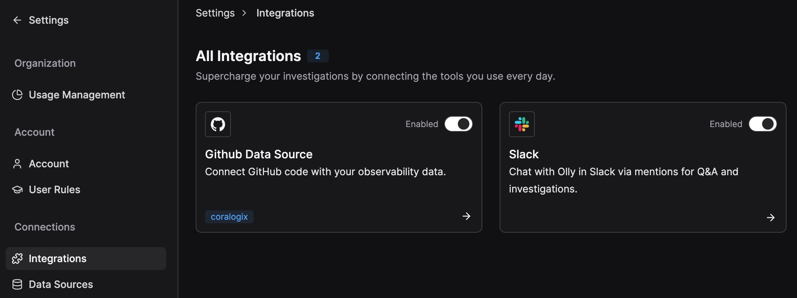
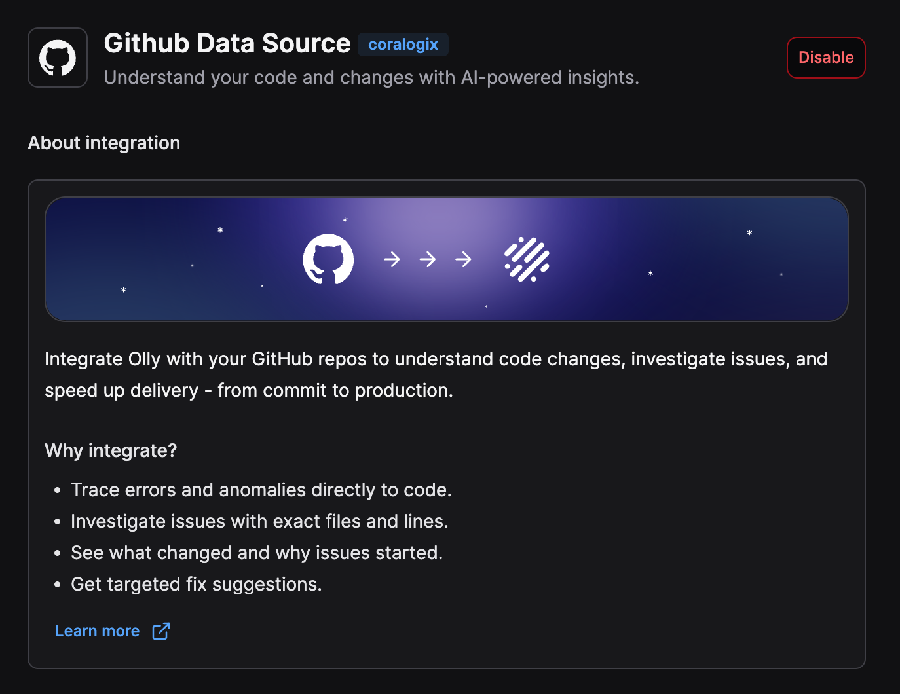
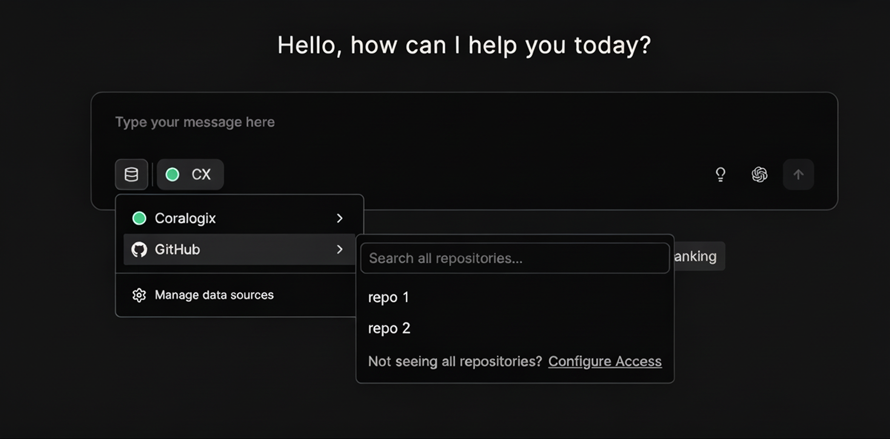

Integrate Olly with your GitHub repositories to understand code changes, investigate issues, and speed up delivery - from commit to production.

## Overview

The GitHub integration allows Olly to use code context when answering questions, running investigations, and performing root cause analysis. By connecting your repositories, Olly can link logs, errors, and alerts directly to the relevant code, highlighting the exact files and lines involved and guiding you toward the right fix.

## Why integrate GitHub?

Enabling GitHub helps Olly move investigations to source code:

- Reduce manual debugging by tracing errors and anomalies directly to code.
- Speed up investigations and RCA with file- and line-level context.
- Understand what changed and why an issue started.
- Get targeted, actionable fix suggestions instead of high-level explanations.

## Example questions Olly can answer

- “Where in the code does this log/error originate?”
- “Show me what changed before this spike.”
- “Which lines are responsible for this issue and how do I fix it?”
- “What’s causing the latency increase in my checkout service?”
- “What’s the root cause of this anomaly?”
- “Why did error rates spike between 10–11 AM?”

## Setup requirements

To enable the GitHub integration:

- You must be an **Olly organization admin** to enable or disable the integration in Olly.

- The GitHub app must be installed in your GitHub organization by either:

    - A **GitHub organization owner**, or
    - A user who is an **admin of at least one repository** in the organization (or when the organization has at least one public repository).

- It is recommended that a **GitHub organization owner** perform the installation of the Olly app in GitHub. If you are not a GitHub organization admin, you can still initiate the installation. For more details, see the installation instructions below.

<Note>Currently, Olly supports one GitHub integration per organization.</Note>

## Admin control and access

- If an admin disables the GitHub integration, all GitHub data sources connected by users in the organization are immediately unavailable.
- Users will no longer be able to use GitHub data sources in chat until the integration is re-enabled.

## Install the GitHub integration

Installing the GitHub integration authorizes the Olly app in your GitHub organization. This allows Olly to access the repositories and permissions required to use code context during investigations and root cause analysis.

1. Go to **Connections → Integrations → GitHub**.
2. Toggle to **Enable**.
3. Complete the GitHub authentication flow.

<Note>Enabling the integration is available only for **Olly organization admins**.</Note> 

Admins can opt out (disable) the integration at any time by using the integration toggle.

<Tip>After installation, the connected GitHub organization appears as a badge on the integration page. This indicates which GitHub organization the Olly app is installed in.
</Tip>

### How repository access works

When the Olly GitHub app is installed:

- The app automatically receives access to all public repositories in the organization.

- It also receives access to any private repositories for which the installing user has sufficient permissions (for example, if they are an admin or owner of that repository).

Access is not automatically granted to all private repositories in the organization.

### Managing repository permissions

Repository access can be managed after installation.

- Repository admins or owners can grant additional access to the Olly app.

- In the chat repository dropdown, selecting **Configure Access** redirects to GitHub.

- From GitHub, users can authorize the Olly app for any repositories for which they have sufficient permissions.

This allows repository-level control over which repositories Olly can access.

<Tip>If there are repositories you can access in GitHub that do not appear in the repository selection dropdown, select **Configure Access** to authorize them, or contact a repository admin or organization owner to grant the Olly app access.
</Tip>

### Access behavior

**If you are not a GitHub organization owner**:

- The integration can still be created.

- You will have immediate access to the public repositories you've selected in the GitHub organization.

- Access to private repositories requires approval from a GitHub organization owner.

Until a GitHub organization owner approves the installation request, private repositories can't be chosen in the chat.

**After owner approval**:

Once a GitHub organization owner approves and completes the GitHub app installation:

- The integration becomes fully active.

- Olly gains access according to the permissions granted.

- Users in the Olly organization can create GitHub data sources normally, including private repositories (subject to granted permissions).

## Next steps

After the GitHub integration is enabled, individual users can connect their GitHub repositories as a personal [data source](https://docs.olly.new/content/olly-github-data-sources).

## Security and compliance

Olly handles GitHub access and code context in accordance with our **Data Processing, Privacy, and Compliance** policies. For details on data handling, [encryption](https://docs.olly.new/content/olly-data-privacy-compliance#data-protection-and-network-security), [access controls](https://docs.olly.new/content/olly-data-privacy-compliance#access-control-behavior), and [compliance standards](https://docs.olly.new/content/olly-data-privacy-compliance#compliance-frameworks-and-attestations), see the [Data Processing, Privacy, and Compliance](https://docs.olly.new/content/olly-data-privacy-compliance) documentation.

For more information on security measures, visit our [AI FAQ](https://coralogix.com/faq-coralogix-ai-tools/), [Trust Center](https://trust.coralogix.com/), and [Addendum to Coralogix Master Subscription Terms – Olly Services](https://coralogix.com/addendum-to-coralogix-master-subscription-terms-olly-services/).

### IP protection guarantee

Coralogix does not assume any ownership, title, or interest in the code or documentation that is accessed through our GitHub integration.

Your code is never used to train AI models and is never shared across tenants.