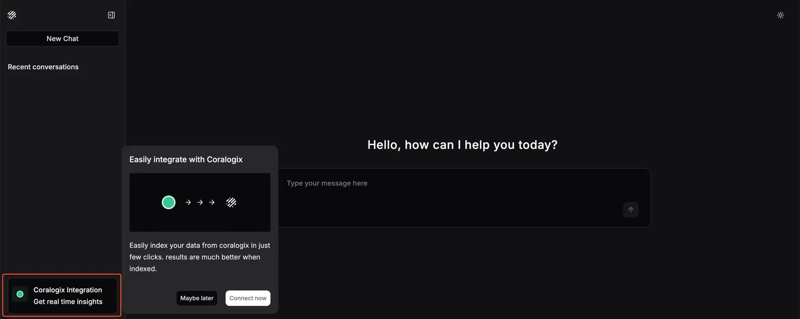
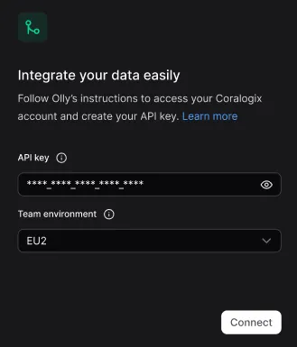
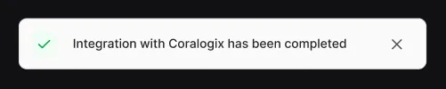

---
title: "Getting Started"
--- 

To start using Olly with your data, connect it to your environment by entering a Coralogix API key in the Olly setup flow.

### Insert your API key and connect

1. When you first arrive at the Olly interface, click the **Coralogix Integration** option in the sidebar menu to open the setup modal. Select **Connect now** to begin the integration process. 
    
    
    
    
2. Paste your Coralogix [API key](https://coralogix.com/docs/user-guides/account-management/api-keys/api-keys/) into the designated field. Once entered, you’ll see confirmation that your credentials have been accepted.
    
    
    
3. Click **Connect** to authorize Olly to access your Coralogix workspace.

4. Wait for the integration to finish. When it’s complete, a green success indicator will confirm that Olly is ready to use.
    
    
    
    Once connected, Olly begins indexing your organizations data and mapping fields in the background. Olly delivers high quality results from the start, with these processes further improving accuracy over time. 
    

You can now begin interacting with Olly directly through the chat interface. Ask any observability question in natural language, and Olly will scan your logs, metrics, and traces to provide insights, root causes, or recommendations.

