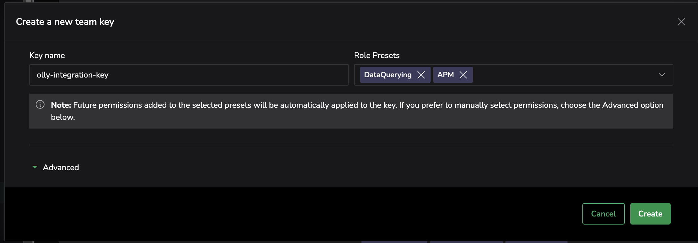

To integrate Olly with your Coralogix environment, you’ll need:

- A Coralogix Team [API key](https://coralogix.com/docs/user-guides/account-management/api-keys/api-keys/) with the following configurations:
    - `DataQuerying` role.
    - `APM` role - advanced permissions `Service Map`
    - `Incidents` role preset
    - `SLO` role preset
- The API key must be created by a Coralogix user with full data access permissions.
- The user account that creates the key should be free of any [data scope](https://coralogix.com/docs/user-guides/account-management/user-management/scopes/) restrictions.

Users must access a dedicated setup interface via [app.olly.new](https://olly.new/), where they can configure the assistant and integrate it with their Coralogix environment. 

This interface provides full access to your connected telemetry and functions independently of the Coralogix UI.

Once enabled, Olly can be deactivated or reconfigured at any time.