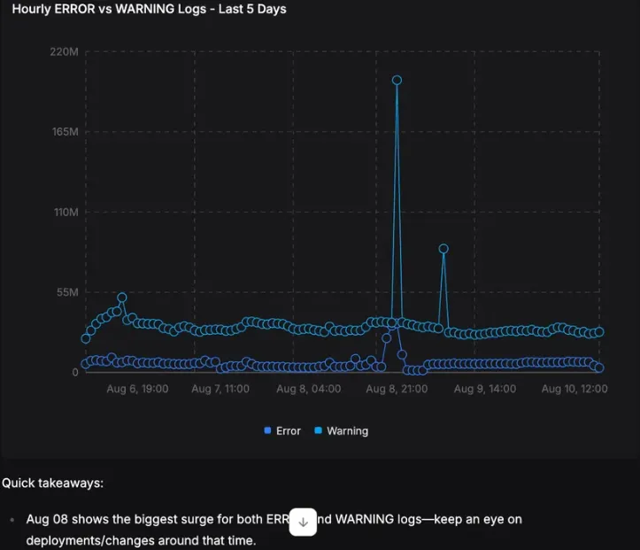
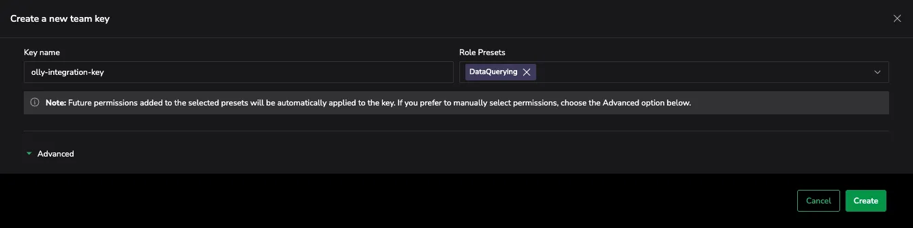

# Olly: Coralogix AI Observability Assistant

**Olly** is Coralogix’s AI-native observability agent that makes observability data fast, accessible, and actionable—for everyone. Traditionally, teams have spent valuable time piecing together dashboards and writing queries to troubleshoot issues. Olly changes that by letting you ask real questions in natural language and delivering instant, intelligent answers from across your logs, metrics, and traces.

Whether you're an engineer, SRE, product owner, or business stakeholder, Olly helps reduce mean time to resolution (MTTR), identify root causes in seconds, and guide you through both immediate fixes and long-term solutions. By interpreting your questions and pulling insights directly from the Coralogix platform, Olly makes observability useful across technical and non-technical teams alike. By the end of this guide, you’ll be able to activate and start using your new AI observability assistant to analyze your telemetry data in real time.

## What Olly can do

Olly has full access to your observability data and is built to simplify and accelerate your observability workflows. 
You can use it to:

- Receive quick, meaningful insights into logs, metrics, traces and errors
- Identify the root cause of incidents and events
- Generate performance overviews in plain English
- Offer guided recommendations to resolve and prevent issues
- Visualize insights with charts—line, bar, pie, stacked bar, area, horizontal bar, and multi-series bar.
    - Olly selects the most effective type automatically, or generates one on request.
- Provide supporting data views alongside answers:
    - Logs: A raw data table of matching log entries
    - Metrics: A line chart showing returned metric values and labels
    - Spans: A Gantt view of the full trace containing the span

By eliminating manual investigation and surfacing the “why” behind system behavior, Olly helps your team respond with speed and confidence.

## How it works

Olly continuously monitors your observability data and interprets your natural language questions in real time. Ask questions like:

- “What’s going on with the payment service?”
- “Why is my app slow today?”
- “Which service is impacting user experience the most?”
- “Why are login errors increasing? How do I fix this problem?”
- “Analyze the request flow between these two services.”
- “Graph CPU usage across the system over the past 6 hours.”

Olly scans your logs, metrics, and traces to uncover patterns, highlight anomalies, and trace problems to their source. It doesn’t just point to symptoms—it offers clear explanations and actionable next steps. The result: faster insights, clearer answers, and less time lost to guesswork.

## Access and activation

Only users with Olly organization admin permissions can integrate with Olly.  If you don’t see this integration option, reach out to us to request access.

> **Note:** Some browser extensions such as **uBlock Origin** may block Olly’s interface. If you’re using uBlock Origin, you’ll need to manually disable blocking for Olly in the extension settings to enable full access.
> 

### Integration requirements

To integrate Olly with your Coralogix environment, you’ll need:

- A Coralogix Team [API key](https://coralogix.com/docs/user-guides/account-management/api-keys/api-keys/) with the `DataQuerying` role.
- The API key must be created by a Coralogix user with full data access permissions.
- The user account that creates the key should be free of any [data scope](https://coralogix.com/docs/user-guides/account-management/user-management/scopes/) restrictions.

Users must access a dedicated setup interface via [app.olly.new](https://olly.new/), where they can configure the assistant and integrate it with their Coralogix environment. 

This interface provides full access to your connected telemetry and functions independently of the Coralogix UI.

Once enabled, Olly can be deactivated or reconfigured at any time.

## Getting started

To start using Olly with your data, connect it to your environment by entering a Coralogix API key in the Olly setup flow.

### Insert your API key and connect

1. When you first arrive at the Olly interface, click the **Coralogix Integration** option in the sidebar menu to open the setup modal. Select **Connect now** to begin the integration process. 
    
    
    
2. Paste your Coralogix [API key](https://coralogix.com/docs/user-guides/account-management/api-keys/api-keys/) into the designated field. Once entered, you’ll see confirmation that your credentials have been accepted.
    
    
    
3. Click **Connect** to authorize Olly to access your Coralogix workspace.

4. Wait for the integration to finish. When it’s complete, a green success indicator will confirm that Olly is ready to use.
    
    
    
    Once connected, Olly begins indexing your organizations data and mapping fields in the background. Olly delivers high quality results from the start, with these processes further improving accuracy over time. 
    

You can now begin interacting with Olly directly through the chat interface. Ask any observability question in natural language, and Olly will scan your logs, metrics, and traces to provide insights, root causes, or recommendations.

## Data processing, privacy, and compliance

Olly is designed with strict privacy and compliance controls. While it leverages **OpenAI's large language models**, **all processing takes place within Coralogix’s private deployment of Azure OpenAI**, hosted entirely in a secure Azure VPC. This ensures that:

- **Your telemetry data remains protected—never accessible to anyone outside your organization**
- **OpenAI and other third-party vendors can’t access or store your data**
- **Processed data is never used to train large language models (LLMs)**

Olly processes the telemetry data relevant to a user’s query—including logs, metrics, and traces—based on the context of the investigation. Processing occurs in **Microsoft Azure data centers**, and aligns with the geographic region selected by the customer (e.g., EU, US, or APAC). **No data is stored externally** during this process.

Olly is fully **GDPR compliant** and may be used in environments requiring **HIPAA compliance**, making it suitable for regulated industries and healthcare contexts.

## Service terms and acceptable use

Olly, Coralogix’s AI Observability Assistant, is governed by the [Coralogix Master Subscription Terms](https://coralogix.com/terms-conditions/) and the [AI Tools Acceptable Use Policy](https://coralogix.com/ai-tools-policy/). These terms outline permitted use, data handling responsibilities, and user obligations for AI-based features.

## Additional resources

*Olly Demo Video*