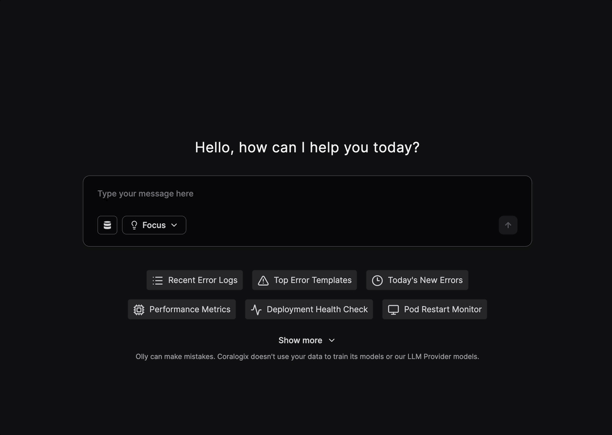

**Olly** is Coralogix’s AI-native observability agent that makes observability data fast, accessible, and actionable - for everyone. Traditionally, teams have spent valuable time piecing together dashboards and writing queries to troubleshoot issues. Olly changes that by letting you ask real questions in natural language and delivering instant, intelligent answers from across your logs, metrics, traces and alerts.

Whether you're an engineer, SRE, product owner, or business stakeholder, Olly helps reduce mean time to resolution (MTTR), identify root causes in seconds, and guide you through both immediate fixes and long-term solutions. By interpreting your questions and pulling insights directly from the Coralogix platform, Olly makes observability useful across technical and non-technical teams alike. By the end of this guide, you’ll be able to activate and start using your new AI observability agent to analyze your telemetry data in real time.

## FAQs

<Accordion title="Is Olly available for all Coralogix customers?">
    Yes - every Coralogix customer can use Olly.
</Accordion>

<Accordion title="Is Olly an AI assistant?">
    No. Other companies build AI assistants which are nice and valuable. They help your users be save time and become more effective in their observability platform; practically saving time of reading documentation. Olly is not about saving time in Coralogix. Olly is Autonomous Observability, allowing you to improve software reliability by 10x.
</Accordion>