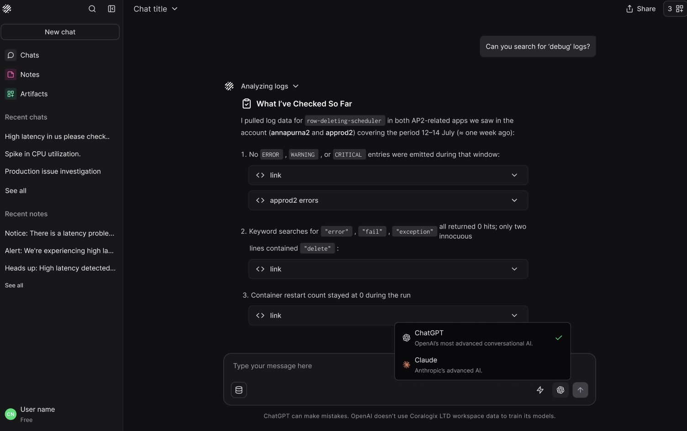

Olly lets you choose which AI model provider to use when answering your questions. This allows you to tailor Olly’s responses to your personal preferences and investigative style.

Different providers vary in how they reason, phrase answers, and approach problem-solving.

## Available providers

Currently, you can choose between GPT and Claude.

When **Claude** is selected, Olly uses the following models based on the mode you choose:

- **Fast mode**: Haiku 4.5

- **Focus mode**: Sonnet 4.5

When **GPT** is selected, Olly uses the following models based on the mode you choose:

- **Fast mode**: GPT-5 mini

- **Focus mode**: GPT-o3

## Why this matters

- Personalized experience: Choose the provider whose tone and reasoning style fits you best.

- Flexibility: Different tasks and users may benefit from different models.

- Consistency: Your selected provider is used throughout the conversation unless changed.

## Coming soon

We’re working on giving you full control over the exact model, not just the provider.
For example, you’ll be able to explicitly select GPT-o3, Haiku 4.5, or Sonnet 4.5.