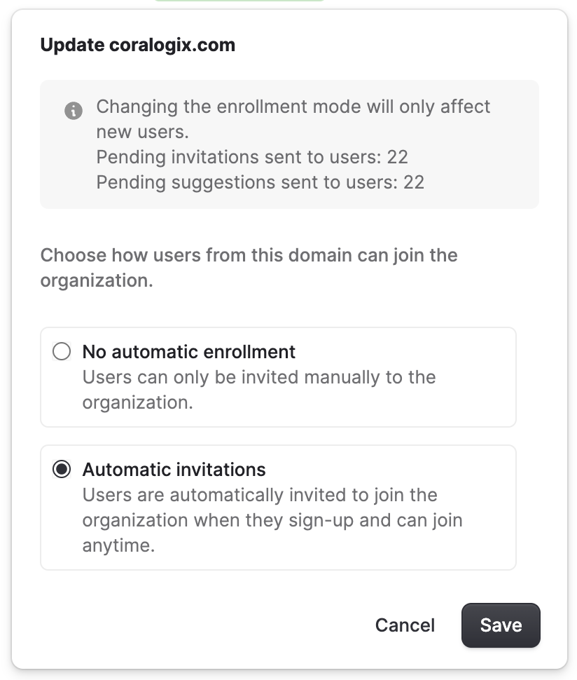

The **Organization** page covers general organization settings in Olly. From here, admins can manage organization details, control access through verified domains, and handle organization-level actions.

## Verified domains and access control

Admins can add verified email domains to control how users join the organization.

### Add a verified domain

1. Go to **Organization → General**.
2. Under **Verified domains**, select **+ Add domain**.
3. Enter the domain.
4. Choose how users from this domain can join the organization. Olly supports two enrollment modes for verified domains:
    - **Automatic invitations**:
        - Any user with a matching email domain (for example, `@coralogix.com`) can join automatically.
        - No manual admin approval is required.
    - **No automatic enrollment**:
        - The domain acts as a recommendation rather than automatic access.
        - Users may request to join and require admin approval.

Admins can update or remove verified domains at any time. To update the existing domain, select **… → Manage**.

## Leave or delete an organization

From **Organization → General**, users can also manage their relationship with the organization:

- **Leave organization:** Allows a user to remove themselves from the organization.
- **Delete organization:** Permanently deletes the organization and all associated data.
    
**Note:** This action is irreversible and available to admins only.