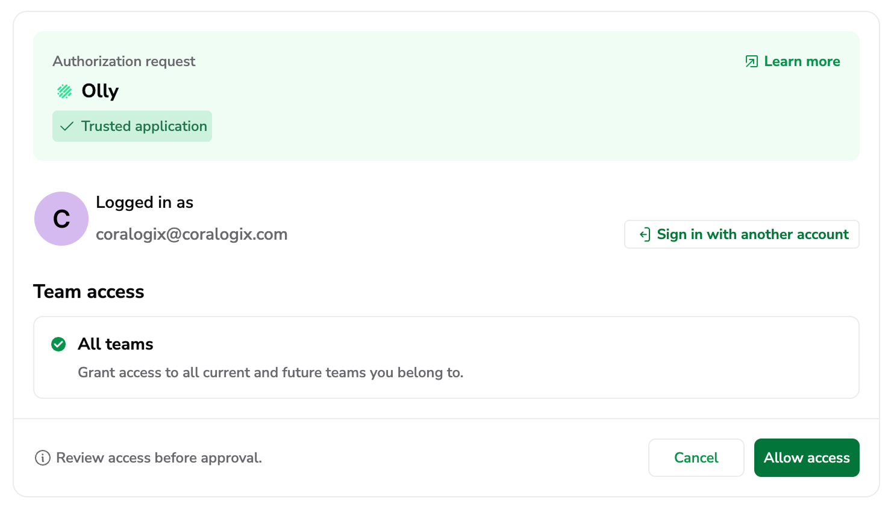

## Overview

This page explains how to sign in to Olly, how you enter an organization, and how Olly decides which region workspace to open.

## Sign-in options

On the sign-in screen, choose one of the available options:

- `Continue with Coralogix`
- `Continue with Google`
- `Sign in with email`
- `Sign up to Olly`

### Continue with Coralogix

Use this option when you want to sign in using your Coralogix identity and context.

1. Select `Continue with Coralogix`.
2. Select your organization's region.
3. Complete the authorization request by choosing your Coralogix account to sign in and selecting **Allow access**.
4. Return to Olly.

**Note:**

- If you have access to multiple organizations, you’ll be prompted to choose which organization to enter.

- Coralogix also affects which region Olly opens.

#### What happens when you select Allow access

When you select **Allow access**, you authorize Olly to securely connect to your Coralogix account using [OAuth](https://coralogix.com/docs/user-guides/account-management/user-management/oauth/). This means that:

1. **An access token is issued**: Coralogix grants Olly a secure access token that represents your approval.
2. **Scope is defined**: The access token includes the teams and environments you allowed Olly to access.
3. **Data sources can be added**: If your team is [AI-enabled](https://docs.olly.new/content/olly-enable-in-cx#enable-olly-for-your-team), Olly uses this access token when adding a data source via the Coralogix tab, limited to the token’s scope.

### Continue with Google

Use this option to sign in to Olly with your Google account.

1. Select `Continue with Google`.
2. Choose the Google account you want to use.
3. Return to Olly.

If you have access to multiple organizations, you’ll be prompted to choose which organization to enter.

### Sign in with email

Use this option to sign in with an email address.

1. Select `Sign in with email`.
2. Enter your email address and continue.
3. Follow the on-screen steps to complete sign-in.

### Sign up to Olly

Use this option if you don’t have an Olly account yet and your organization allows sign-ups (for example, during onboarding or a proof of concept) or you have received an invitation to sign-up.

1. Select `Sign up to Olly`.
2. Enter your email address and follow the on-screen steps to create your account.
3. After you finish sign-up, Olly takes you into your organization.

If you can’t sign up or you don’t see your organization after sign-up, contact your Coralogix representative.

## Join an organization

You can join an organization in two ways:

- Direct invitation: someone adds your email address to the organization.
- Domain-based access: your email domain is allowed to join automatically (if enabled for the organization).

On your first sign-in:

- If you have access to only one organization, Olly takes you there automatically.
- If you have access to multiple organizations, Olly asks you to choose which one to enter.

You can switch organizations later from the organization selector in the UI.

## Choose an organization

If you have access to more than one Olly organization:

- On sign-in, you’ll be prompted to choose which organization to enter.
- After you enter an organization, you can switch organizations later from the organization selector.

If you have access to only one organization, Olly takes you there automatically.

## How Olly selects your region at sign-in

After you enter an organization, Olly opens a region workspace using the following order:

1. **Last used region**: Olly returns you to the region you used most recently within that organization.
    
2. **Region from Coralogix sign-in**: If you signed in using `Continue with Coralogix`, Olly opens the region that matches your Coralogix sign-in context.
    
3. **Organization default region**: If neither of the above applies, Olly opens the organization’s default region.
    
If you have access to multiple regions, you can switch regions at any time from the region selector.

## What you can do after you sign in

Once you’re inside an organization:

- You can use any shared data sources that an admin shared with you.
- You can create your own private data sources for your own use.
- If you are an Org Admin, you can create and manage shared data sources for your team.

To create or manage data sources, go to `Settings → Data sources`.

## Connect Coralogix during onboarding

When you choose `Continue with Coralogix` during onboarding, or when you sign in with Coralogix while creating a data source, you go through a Coralogix OAuth flow.

During this flow, Olly requests access to:

- Read data from the Coralogix team or teams you select
- Create or use a Team API key on your behalf (depending on your Coralogix permissions)

After you complete the flow:

- Olly creates a data source (private or shared, depending on your choice and role).
- You select the specific Coralogix team to associate with that data source.

For the full set of options (API key vs Coralogix sign-in, private vs shared, sharing, and Slack), see the Data sources page.

## Next steps

- If you need to connect Coralogix data, create a data source from `Settings → Data sources`.
- If you landed in the wrong region, switch regions from the region selector in the header or user menu.