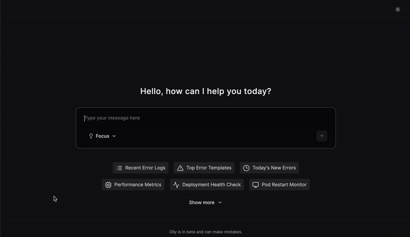
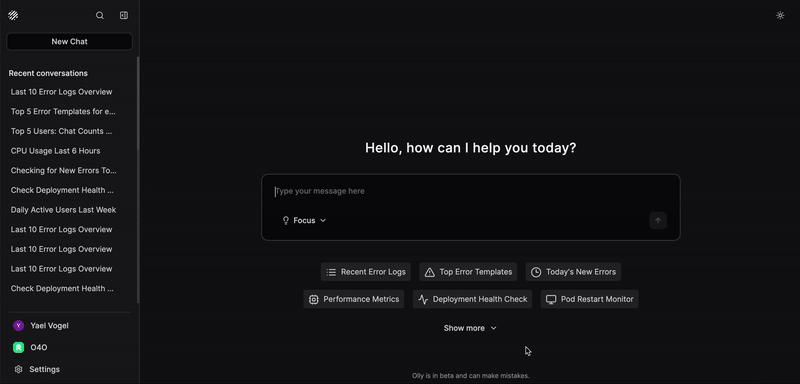

### ✨ **Fast Mode**

Olly now supports two powerful modes to match your workflow. **Fast Mode** delivers responses at lightning speed, helping you get quick answers and act instantly when time matters most. For deeper analysis and richer context, switch to **Focus Mode**, which provides detailed, in-depth insights.

Effortlessly toggle between modes to balance speed and depth - get exactly what you need, when you need it.

### 🔗 **Chat Sharing**

Share Olly sessions and insights with your team using shareable links - making collaboration fast and effortless.

You can toggle sharing on or off at any time. Shared chats are view-only for others.

- **Note:** You can toggle sharing on or off at any time. Shared chats are view-only for others.

### 🧩 **Artifact Previews**

You can now see artifact previews directly in Olly’s responses - including logs, traces, charts and more - without leaving the chat.

### 🗑️ **Chat Deletion**

You can now easily delete chat titles using the new chat deletion feature.

### ✏️ **Message Editing**

Easily edit your prompts and get an updated response - no need to start a new chat.

### ⚡ **Access to Alerts**

Olly now has access to your Coralogix alerts and incidents, in addition to logs, metrics, and traces. Ask natural questions to get linked answers with context and suggested next steps.

**Try asking:**

- What's my most recent alert?
- What is the root cause of this specific alert?
- Why was an alert triggered at 00:05 on Sunday?
- I see this error. What alert would you suggest I set up to monitor this?
- Give me a list of all of the alerts I have set up for this environment.

### 📋 **Prompt Templates**

Get started faster with ready-made prompt templates. Select a template, and Olly will fill in a suggested prompt you can modify and run. Templates cover common onboarding and troubleshooting flows, helping you move from question to insight more quickly.

### 🔍 **Search Functionality**

Find past work faster with chat search. Use the search box or press **Ctrl+K** (Windows) or **Command+K** (macOS) to search your chat titles and content.

 