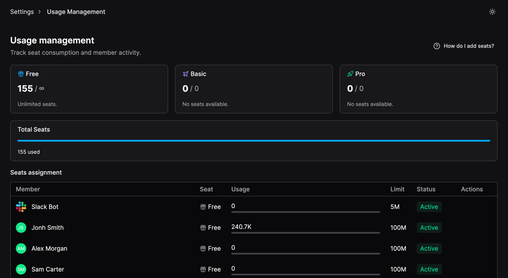
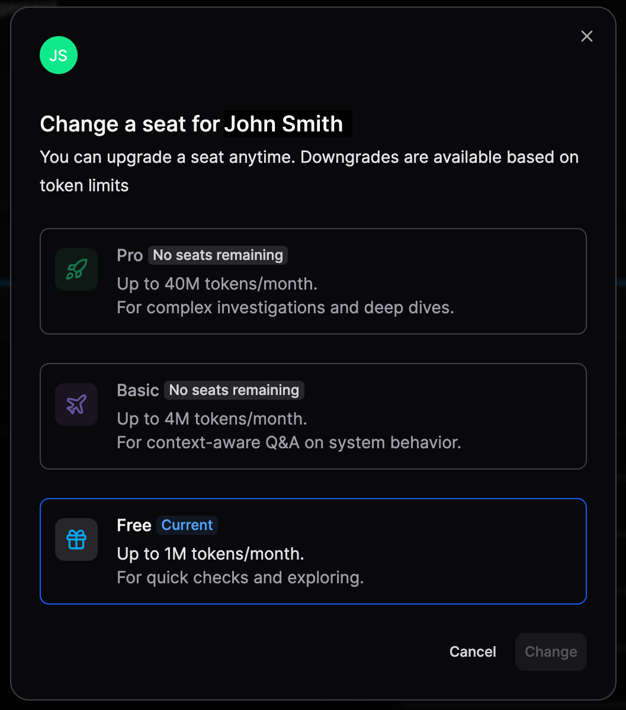

Admin Usage Management gives organization admins visibility and control over seat usage across the organization. From this page, admins can track consumption, assign seat tiers, and manage capacity to ensure users have the right level of access.

## Track usage and seat consumption

Admins can view:

- Total seats in use across the organization.
- Seat distribution by tier (Free, Basic, Pro).
- Individual member seat, token usage, limit, and status.

## Change a user’s seat

Admins can change a member’s seat tier at any time:

1. Go to **Settings → Usage Management.**
2. Locate the user under **Seats assignment.**
3. Select **Actions** → **Change seat**
4. Choose **Free**, **Basic**, or **Pro**.

Seat upgrades are applied immediately.

## Downgrade behavior and quota limits

Seat downgrades are subject to the user’s current token usage:

- A user can only be downgraded if their current usage does not exceed the quota of the target seat.
- If the user has already exceeded the lower-tier quota, the downgrade is not available.
- Downgrades become available again after the monthly quota resets.

For example, if a user consumed 500K tokens on a Basic seat and the Free seat limit is 400K tokens, the admin cannot downgrade the user to Free until the next month, when usage is reset.

### Seat availability and limits

- Each seat tier has a predefined monthly token limit
- Seat availability depends on your organization’s current capacity.
- Seats can only be assigned if capacity is available for that tier.
- Downgrades may be limited by current usage or token consumption.
- If no seats are available, the tier will appear as unavailable.

## Adding more seats

Adding additional seats requires assistance.

If your organization needs more **Basic** or **Pro** seats, contact **Olly Support** to expand your seat capacity.