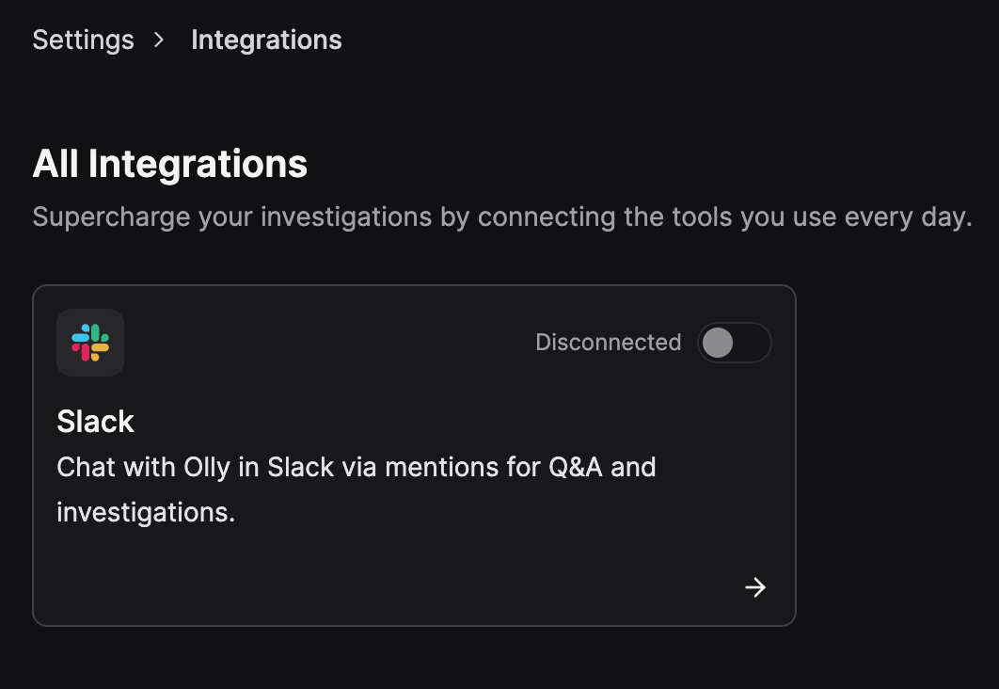

Bring Olly into team conversations on Slack. Mention Olly in **public and private channels**, or in a **DM** to get threaded answers and linked artifacts directly in Olly.

## Overview

Enable seamless integration between Olly and Slack to bring AI-powered collaboration directly into your team’s communication.  
With Olly available in channels and DMs, your team can access intelligent answers and artifacts — right where conversations happen.

## Why integrate?

- Communicate directly with Olly in channels or DMs using your region handle (e.g., `@Olly-EU2`).
- Receive threaded responses from Olly to keep conversations organized.
- Get links from Slack back to Olly artifacts for deeper exploration.
- Streamline collaboration by turning chat requests into tracked insights and actions.

## Requirements

To install the Olly Slack integration and ensure it works smoothly, make sure the following requirements are met:

- **You have Olly organization admin permissions**: Only organization admins can install and manage the Slack integration.

- **You have an Olly account**: Slack messages are linked to individual Olly users. If you don’t have an account yet, Olly will ask you to sign up.

- **You use a shared Coralogix data source**: Slack can only use shared data sources.

- **You’re part of the Olly organization connected to this Slack workspace**: If you’re in Slack but not in the connected Olly organization, Olly won’t be able to answer your questions.
Each Slack workspace can be connected to only one Olly organization at a time. 

- **You connect only one Olly organization per Slack workspace**: A Slack workspace can be connected to only one Olly organization at a time. If an Olly integration already exists in that workspace, you can’t connect another Olly organization from the same region.

- **You have available tokens**: Olly checks your personal token quota before answering:

    - If you have available tokens, Olly responds normally.
    - If your tokens run out during the response, Olly will let you know and still provide a full answer.
    - If you reach your token limit, Olly will let you know and prompt you to contact your admin to increase your quota.

## How to install

1. Go to **Settings → Integrations → Slack**.
2. Select **Connect Slack** and follow the Slack OAuth flow.
3. When prompted, choose which shared data source Slack should use. **Only shared data sources can be exposed to Slack**.
4. Save your changes.
Once connected, Olly answers using the selected data source.

You can change the Slack data source later. The new selection applies to future questions; past messages are unaffected.
Slack uses one Coralogix data source at a time.

## How it works

- Add the Olly app to the target channel using `/invite @Olly-<region>` (e.g., `/invite @Olly-EU2`) or send a message directly to the app as a DM.  
- In any public or private channel, or in a DM with your Olly app, mention your region-specific handle with a clear prompt:  
  - `@Olly-EU2 show P95 latency for auth-service (last 24h)`  
  - `@Olly-EU2 summarize the 500s spike after the latest deploy`
- When you send a message, Olly identifies you using your Slack user and links the request to your Olly account in the organization connected to the Slack workspace.
- Olly replies **in a thread** to keep conversations tidy.
- Continue the conversation with Olly in the thread using the `@Olly-<region>` handle.
- Replies include links to related **artifacts in Olly** for deeper analysis.
- Slack thread content is **not mirrored** as chat in Olly — only artifacts are accessible.
