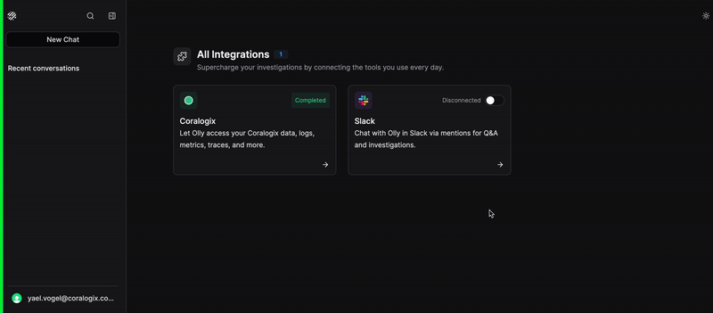

Bring Olly into team conversations on Slack. Mention Olly in **public and private channels**, or in a **DM** to get threaded answers and linked artifacts directly in Olly.

## Overview

Enable seamless integration between Olly and Slack to bring AI-powered collaboration directly into your team’s communication.  
With Olly available in channels and DMs, your team can access intelligent answers and artifacts — right where conversations happen.

## Why integrate?

- Communicate directly with Olly in channels or DMs using your region handle (e.g., `@Olly-EU2`)
- Receive threaded responses from Olly to keep conversations organized
- Get links from Slack back to Olly artifacts for deeper exploration
- Streamline collaboration by turning chat requests into tracked insights and actions

## Requirements

- **Slack Workspace Admin** permissions to install  
- An Olly organization integrated with Coralogix  
- You must be an **Olly organization admin** to install  
- Add the Olly app to the target channel using `/invite @Olly-<region>` (e.g., `/invite @Olly-EU2`) or send a message directly to the app as a DM  
- Use your **region-specific tag** when mentioning Olly (e.g., `@Olly-EU2`)

## How to install

1. In Olly: go to **Settings → Integrations → Slack**  
2. Click **Connect** and approve in Slack (as Admin) to add the Olly app to your workspace  
3. Once connected, the status will show **Connected**

## How it works

- In any public or private channel, or in a DM with your Olly app, mention your region-specific handle with a clear prompt:  
  - `@Olly-EU2 show P95 latency for auth-service (last 24h)`  
  - `@Olly-EU2 summarize the 500s spike after the latest deploy`
- Olly replies **in a thread** to keep conversations tidy  
- Replies include links to related **artifacts in Olly** for deeper analysis  
- Slack thread content is **not mirrored** as chat in Olly — only artifacts are accessible  
