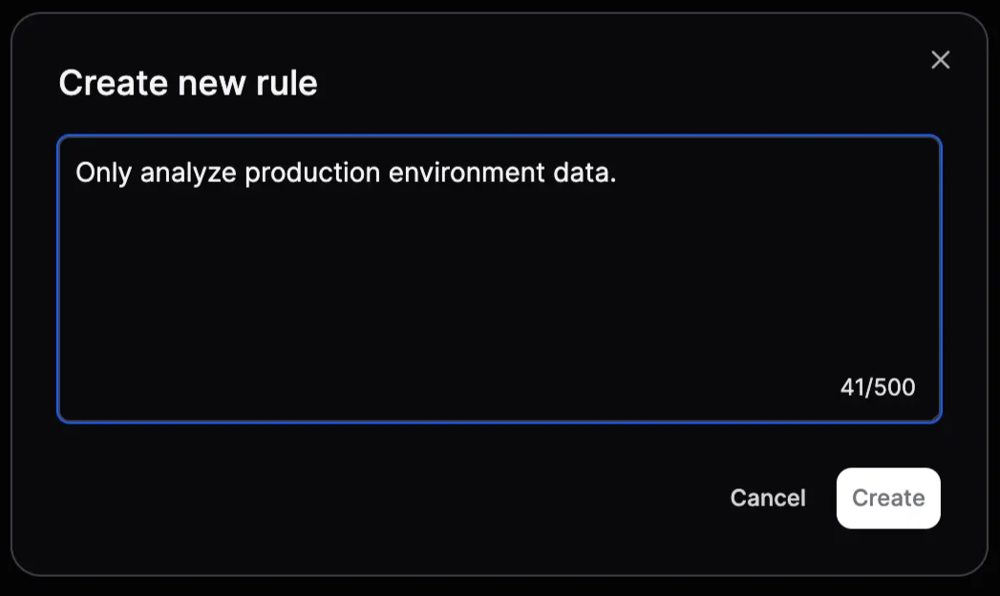

User rules allow you to customize how Olly responds to you by defining personal preferences in plain text. These rules give Olly additional context about your environment, workflows, and response style, so it can better align with how you work and deliver more accurate, consistent insights across sessions.

## What are user rules?

User rules are short, user-defined instructions that Olly applies automatically when generating responses.

They can be used to:

- Control response behavior.
- Provide contextual constraints for investigations or analysis.
- Enforce consistent assumptions across conversations.

**Example rules:**

- “The label ‘application’ in my logs refers to the customer name.”
- “When I ask about ‘chats’, use custom metrics.”
- “Only analyze production environment data.”
- “Highlight error spikes over latency regressions.”

## How user rules work

- Rules are written in plain text.
- Each rule is stored per user.
- Rules persist across sessions.
- Olly automatically takes them into account in every interaction.

This ensures your preferences are always applied without needing to repeat them in every conversation.

## Creating a user rule

To set up a user rule:

1. Go to **Settings → Account → User Rules**.
2. Select **+ New rule**.
3. Type your rule in plain text.
4. Select **Create**.

Your rule will now appear in the **User Rules** page.

## Editing or deleting rules

- You can edit an existing rule at any time from the **User Rules** page.
- You can also delete a rule if it’s no longer relevant.
- Changes take effect immediately and apply to all subsequent interactions.

## Guardrails & validation

To keep Olly safe and reliable, all user rules are validated before being saved.

Each rule is automatically checked for:

- **Inappropriate language**
- **Restricted topics**:
    - Competitors
    - Violence
    - Sexual content
    - Other prohibited subject matter
- **Security risks**:
    - SQL injection
    - Prompt injection
    - Other malicious patterns

If a rule fails validation, it is not be saved and you receive an error message explaining that the rule can’t be added.