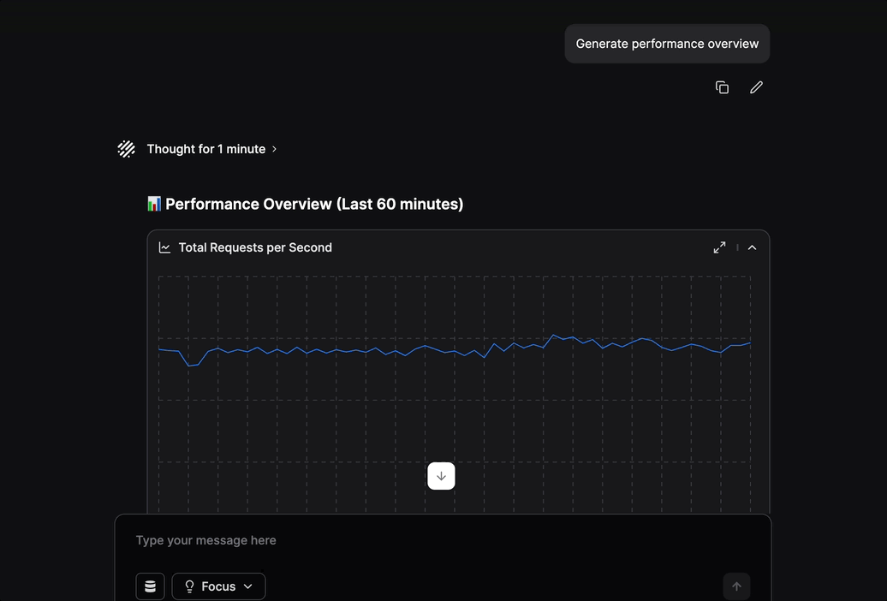

Olly has full access to your observability data and is built to simplify and accelerate your observability workflows. 
You can use it to:

- Receive quick, meaningful insights into logs, metrics, traces and errors
- Identify the root cause of incidents and events
- Generate performance overviews in plain English
- Offer guided recommendations to resolve and prevent issues
- Visualize insights with charts - line, bar, pie, stacked bar, area, horizontal bar, and multi-series bar.
    - Olly selects the most effective type automatically, or generates one on request.
- Provide supporting data views alongside answers:
    - Logs: A raw data table of matching log entries
    - Metrics: A line chart showing returned metric values and labels
    - Spans: A Gantt view of the full trace containing the span
    - Alerts: The logs that triggered the alert

By eliminating manual investigation and surfacing the “why” behind system behavior, Olly helps your team respond with speed and confidence.
